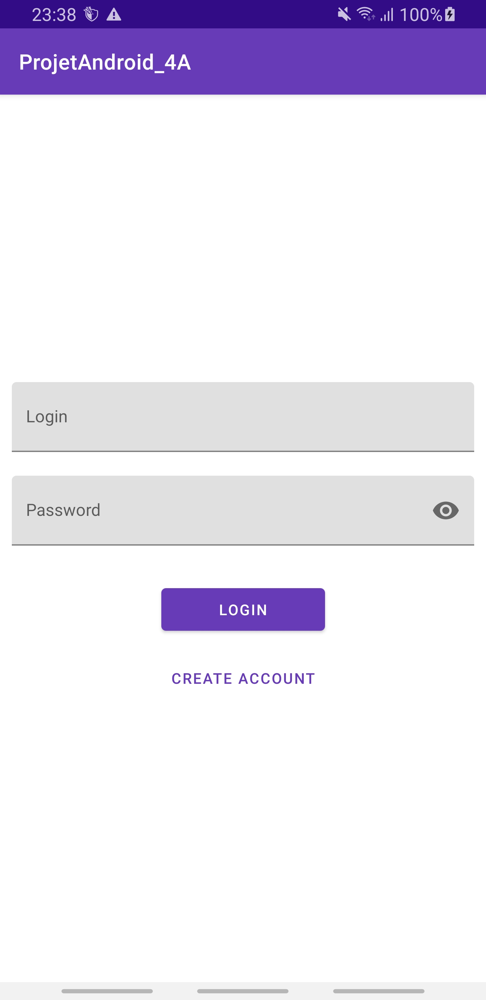
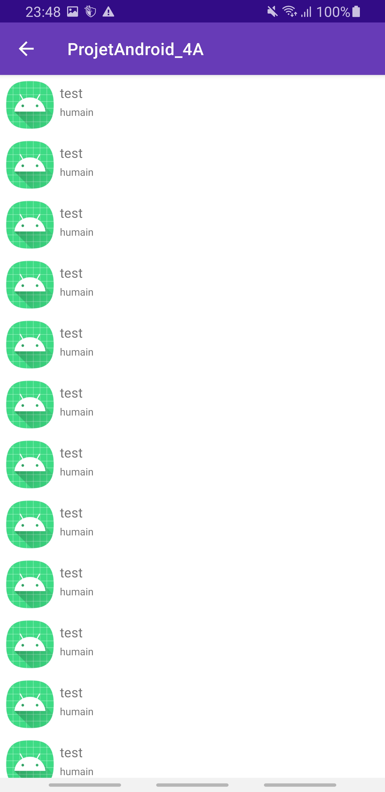

<h1>Projet Android Kotlin 4A</h1>

<h2>
  Fonctionnalités :
</h2>
<h3>
  Écran d'accueil qui nous demande de rentrer nos identifiants pour nous connecter, un message d'erreur apparaît si le compte n'existe pas ou qu'un champ est vide :
</h3>
<ul>
  <li>Contient les champs "Login" et "Password"</li>
  <li>Contient deux boutons "Login" et "create account"</li>
</ul>

<h3>
  Écran création du compte, un message d'erreur apparaît si le compte est créé, si le nom est déjà utilisé ou qu'un champ est vide :
</h3>
<ul>
  <li>Contient les champs "Login" et "Password"</li>
  <li>Contient un bouton "Create"</li>
</ul>

   
  

<h3>
  Écran avec une liste, écran affichait si un utilisateur est connecté
</h3>
<ul>
  <li>Affiche une liste</li>

</ul>

